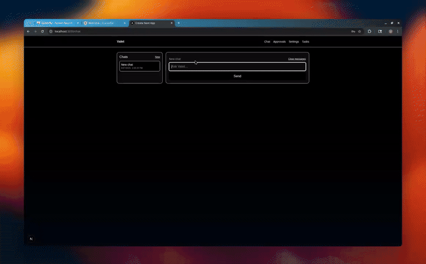

## Valet

Valet is a secure, extensible executive assistant with a modern chat UI, approvals, and an audit trail. It can draft emails, manage calendars, take notes, create reminders, and build a demo groceries cart — with human approval before any irreversible action.



### Highlights

- Modern Next.js App Router UI with a multi-chat sidebar (create, rename, delete), animated bubbles, timestamps, and streaming replies
- Client-only OpenAI key storage (Settings → OpenAI) with optional server-side encrypted storage if configured
- Typed tool registry (Zod) and safe tool-calling with approvals for risky actions
- Append-only audit logging; RBAC with NextAuth Google
- Dev-friendly: Vitest unit tests, Playwright E2E (with optional video), and clear docs

---

## Quickstart

1) Install deps and set up DB
```bash
pnpm install
pnpm prisma:migrate
pnpm db:seed
```

2) Configure environment
```bash
cp .env.example .env
# edit .env with your values (or keep USE_MOCK_LLM=true for demo)
```

3) Start the app
```bash
pnpm dev
# http://localhost:3000 (Playwright will auto-run on 3030 when using e2e tests)
```

4) Open Settings → OpenAI and paste your API key (client-only). You can also sign in with Google to enable email/calendar tools.

---

## Tech Stack

- Frontend: Next.js App Router, TypeScript, Tailwind
- Auth: NextAuth (Google)
- LLM: OpenAI (Responses API ready; mockable), server-side tool-calling
- ORM/DB: Prisma + SQLite (dev), Postgres in prod
- Tests: Vitest (unit), Playwright (E2E)

---

## Features

- Chat with SSE streaming, multi-chat management, and animated UI
- Approvals: irreversible/spend-money actions require explicit approval
- Audit Log: append-only records with timestamps and user IDs
- Tools (typed via zod): email_*, calendar_*, notes_upsert (Notion), reminders_create, groceries_*, memory_*
- Integrations: Google (Gmail/Calendar), Notion, Demo Groceries

---

## Scripts

```bash
pnpm prisma:generate   # Prisma codegen
pnpm prisma:migrate    # Apply dev migrations
pnpm db:seed           # Seed demo user and sample task
pnpm test:unit         # Vitest (unit)
pnpm test:e2e          # Playwright (starts dev server on 3030)
pnpm demo:gif          # Convert Playwright video to GIF (scripts/make-demo-gif.sh)
pnpm deploy:vercel     # Deploy via Vercel CLI (requires login or VERCEL_TOKEN)
```

---

## Repo Structure

```
app/                  # UI (App Router)
  api/                # Route handlers (agent, approvals, user/openai)
  chat, approvals, settings, tasks
components/ui/        # Design system (Card, Badge, Input, etc.)
server/agent/         # Tools, router, services, approvals, audit
server/llm/           # Prompt and OpenAI client (user-key aware)
prisma/               # Prisma schema & migrations
packages/shared/      # Shared types & zod wrappers
tests/                # Vitest unit & Playwright e2e
scripts/              # seed script, helper scripts
docs/                 # Additional documentation
```

---

## Environment

Copy `.env.example` to `.env` and set the following:

- NEXTAUTH_URL
- NEXTAUTH_SECRET
- DATABASE_URL (SQLite dev; Postgres in prod)
- USE_MOCK_LLM (true for demo without OpenAI)
- OPENAI_API_KEY (fallback if user key not set)
- ENCRYPTION_KEY (>=32 chars) for user-secret encryption
- GOOGLE_CLIENT_ID / GOOGLE_CLIENT_SECRET (optional, for Gmail/Calendar)
- NOTION_TOKEN (optional) and NOTION_DEFAULT_DATABASE_ID (optional)
- GROCERIES_DEMO=true

User-specific OpenAI keys can be stored client-only (localStorage). If `ENCRYPTION_KEY` is set, server-side encrypted storage is also supported.

---

## Development

```bash
pnpm install
pnpm prisma:migrate
pnpm db:seed
pnpm dev
```

Run at `http://localhost:3000`. Playwright e2e config will auto-start on port 3030.

---

## Testing

```bash
pnpm test:unit   # Vitest
pnpm test:e2e    # Playwright (auto-starts dev server on 3030)
```

To record videos and make a GIF:
```bash
pnpm test:e2e:video
pnpm demo:gif
```

---

## Deployment (Vercel + Neon Postgres)

Option A: Vercel Dashboard
1) Create a Neon Postgres and copy the connection string
2) Push the repo to GitHub
3) Vercel → New Project → Import repo
4) Set env vars (Production & Preview):
   - NEXTAUTH_URL: https://<project>.vercel.app
   - NEXTAUTH_SECRET: long random string
   - DATABASE_URL: Neon connection string
   - USE_MOCK_LLM: true (or provide OPENAI_API_KEY and ENCRYPTION_KEY)
   - GROCERIES_DEMO: true
   - Optional: GOOGLE_CLIENT_ID/SECRET, NOTION_TOKEN
5) Deploy

If the DB is fresh, run migrations (either via Vercel Postgres integration or locally against the prod DB):

```bash
DATABASE_URL="<prod-url>" pnpm prisma migrate deploy
```

Option B: Vercel CLI
```bash
pnpm dlx vercel@latest login
pnpm deploy:vercel
```

See `docs/DEPLOY.md` and `docs/README.md` for more.

---

## Security

- No secrets in client or logs; user API keys encrypted at rest when stored server-side
- Idempotent, audit-logged actions
- Approval-gated irreversible/spend actions
- Strict TypeScript + zod validation at all edges

---

## Troubleshooting

- Port in use: kill process on 3030 or set a different port
- If Prisma types lag after migrations, re-run `pnpm prisma generate`
- Clear Next cache on odd dev errors: remove `.next` and restart
